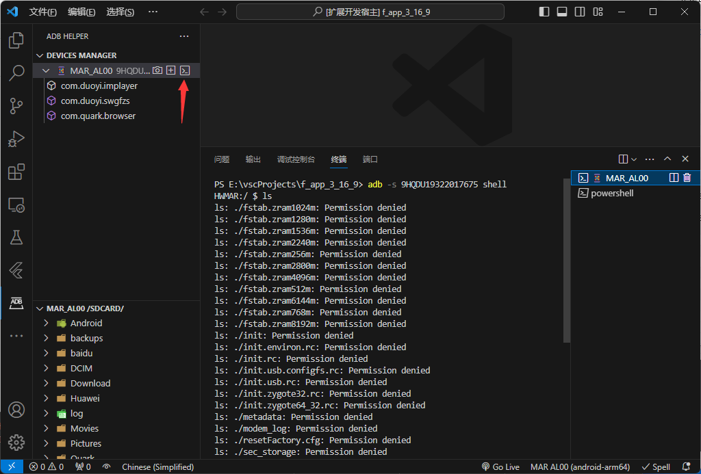

# adb-helper

[](https://marketplace.visualstudio.com/items?itemName=jawa0919.adb-helper) [](https://marketplace.visualstudio.com/items?itemName=jawa0919.adb-helper) [](https://marketplace.visualstudio.com/items?itemName=jawa0919.adb-helper) [](https://github.com/jawa0919/adb-helper/issues)

## Introduction

[【English】](./README.md)|[【中文】](./README_zh.md)

Helps execute common `ADB` commands. Device management, `ip/pair` connections, device screenshots, app management, file management.


## Features

### AdbController

- [x] restartAdb: Restart ADB service
- [x] refreshDeviceManager: Refresh device list and apk list
- [x] ipConnect: Connect to device by entering IP address
- [x] ipConnectHistory: Display history of IP connections
- [x] pairDevicesScanner: Scan for pairable devices (Android 11+)
- [x] pairDevicesUsingQRCode: Pair devices using QR code (Android 11+)
- [x] pairDevicesUsingCode: Pair devices using pairing code (Android 11+)
- [x] installToDevice: Install apk files from workspace to device
- [x] chooseApkFilter: Select apk display types, -3: third-party apps (default), -s: system apps, -e: enabled apps, -d: disabled apps


### DeviceController

- [x] screenshot: Take device screenshot
- [x] installApk: Install apk
- [x] openShell: Open shell
      
- [x] inputText: Input text to device
- [x] showDeviceInfo: Display device related information
- [x] startScrcpy: Launch Scrcpy [https://github.com/Genymobile/scrcpy](https://github.com/Genymobile/scrcpy)
- [x] showTopActivity: View top activity
- [x] rebootDevice: Reboot device
- [x] powerOffDevice: Power off device
- [x] useIpConnect: Connect ADB using IP
- [x] showLogCat: Display logcat logs
- [x] closeLogCat: Close logcat logs


### ApkController

- [x] wipeApkData: Clear apk data
- [x] wipeApkPermissions: Clear apk permissions
- [x] uninstallApk: Uninstall apk
- [x] exportApk: Export apk
- [x] stopApk: Stop apk
- [x] copyApkId: Copy apk id
- [x] showAppLogCat: Display logcat logs for this apk


### ExplorerController

- [x] refreshExplorerManager: Refresh explorer
- [x] chooseDevice: Select device in explorer
- [x] chooseRootPath: Select root directory in explorer

### FileController

> In the file management system, opened files are copies of device files mirrored locally.

> In the `/data/data/` directory, due to lack of permissions, directories cannot be obtained. Related file directories are simulated.

- [x] openFile: Open file
- [x] openInTheSide: Open file on the right side
- [x] openInLocalExplorer: Open in local file explorer
- [x] newFolder: Create new folder
- [x] copyPath: Copy path
- [x] rename: Rename
- [x] delete: Delete
- [x] uploadFile: Upload file
- [x] uploadFolder: Upload folder
- [x] saveAs: Save as to local


### flutter daemon

> When `flutter` is not found, click `refreshDeviceManager` to update device list.

- [x] flutter daemon: Monitor device connection/disconnection, automatically refresh list

## Configuration

- [x] explorerRootPathList: Quick access list, first item in list is displayed by default

  ```json
  [
      "/sdcard/",
      "/",
      "/data/data/",
      "/sdcard/Android/data/",
      "/sdcard/DCIM/",
      "/sdcard/Download/",
  ],
  ```

- [x] adbBinPath: Path to `adb` binary, e.g.: `E:\sdk\androidSDK\platform-tools`
- [x] androidSdkPath: Path to `Android` SDK, e.g.: `E:\sdk\androidSDK`
- [x] flutterSdkPath: Path to `Flutter` SDK, e.g.: `E:\sdk\flutter339`
- [x] scrcpyBinPath: Path to `Scrcpy` binary, e.g.: `C:\Users\admin\AppData\Roaming\Genymobile\scrcpy`

If related environment variables are already configured, you can ignore these configurations

## Related

[https://github.com/Genymobile/scrcpy](https://github.com/Genymobile/scrcpy)

## Finally

Welcome to share ideas and report issues [issues](https://github.com/jawa0919/adb-helper/issues)
