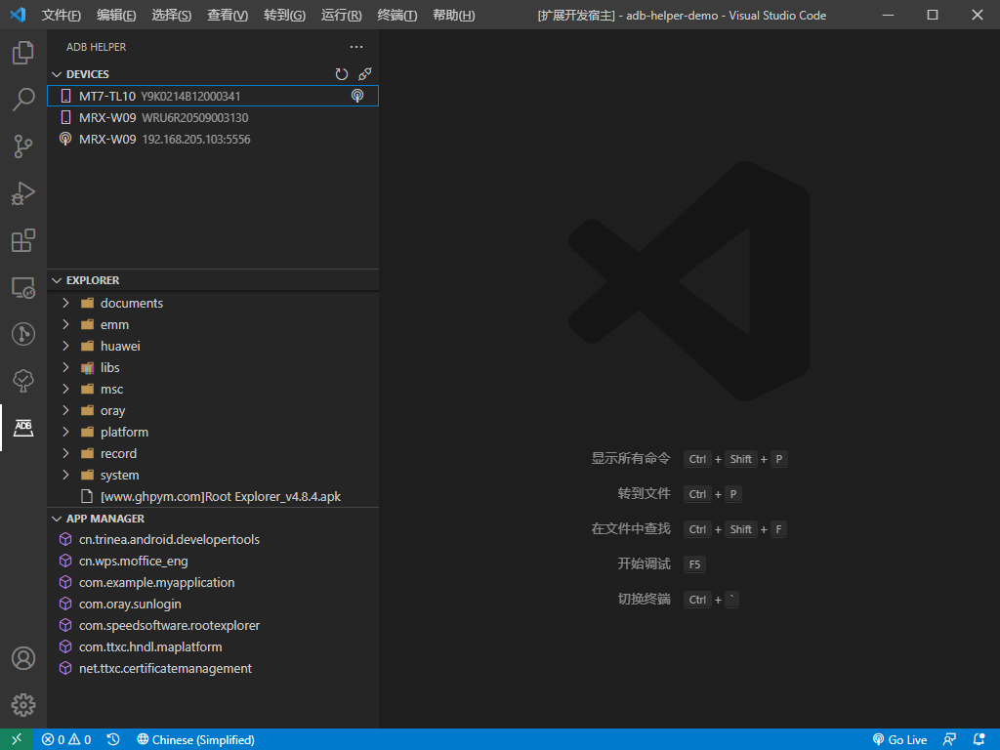
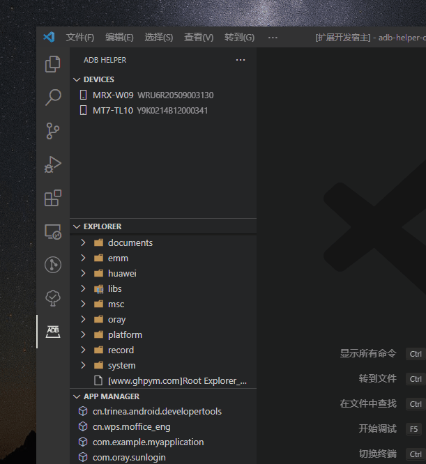
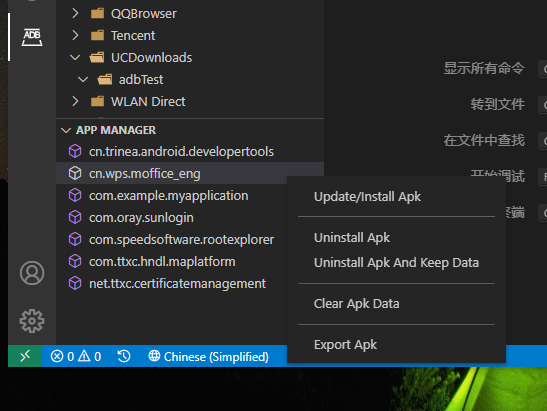

# adb-helper

## 简介

[【English】](./docs/README_EN.md)

ADB 帮手，辅助执行 adb 常用命令。目前功能有 设备管理器，文件管理器，应用管理器。



## 更新

- 设备管理器，用于管理 adb 连接的设备。

- 文件管理器，用于设备上各种文件管理。与 Android Studio 文件管理类似。

- 应用管理器，用于设备上第三方应用的管理。

## 功能

1. 使移动设备通过 wifi 连接电脑端，可代替 usd 连接。

   

2. SDCard/Root 文件管理，包含新建文件夹，导出文件/文件夹，导入文件，导入文件夹，删除文件/文件夹，复制文件路径。

   

3. 应用管理器，升级 apk，卸载 apk，清除 apk 缓存，导出 apk。

   

## adb

```
Android Debug Bridge version 1.0.41
Version 31.0.3-7562133
Installed as E:\sdk\android\platform-tools\adb.exe
```
