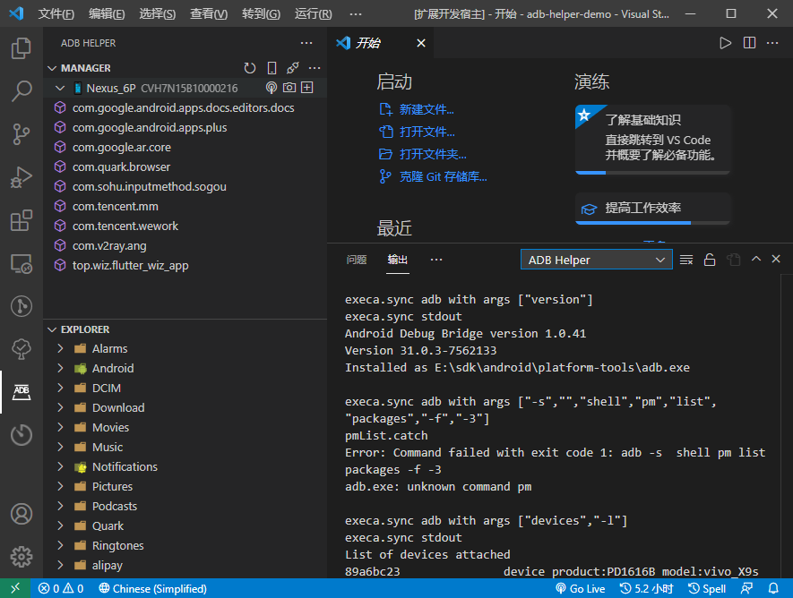
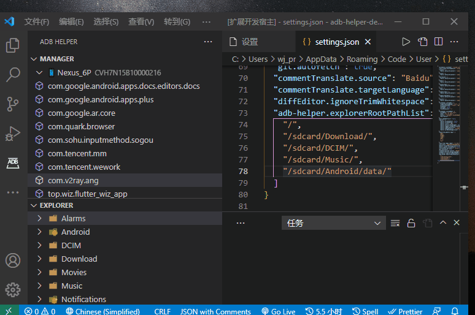
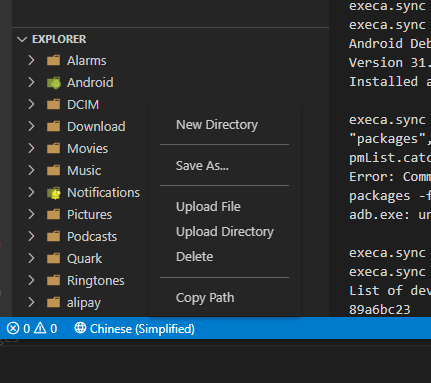

# adb-helper

[](https://marketplace.visualstudio.com/items?itemName=jawa0919.adb-helper) [](https://marketplace.visualstudio.com/items?itemName=jawa0919.adb-helper) [](https://marketplace.visualstudio.com/items?itemName=jawa0919.adb-helper) [](https://github.com/jawa0919/adb-helper/issues)

## introduction

[【中文】](./README_CN.md)

Assist in executing common ADB commands. At present, the functions include device management, WiFi connection, screenshot, application management and file management.



## update

- Application manager, which is used to manage the management of third-party applications on the device。

- File manager, used to manage various files on the device, similar to Android studio file management。

## Function

1. Application manager, including creating new folders, exporting files / folders, importing files, importing folders, deleting files / folders, and copying file paths.

2. adbWifi manager，Connect Android devices to the computer through WiFi, which can replace USB connection.

   

3. File Management, including creating new folders, exporting files / folders, importing files, importing folders, deleting files / folders, and copying file paths.

   

   You can configure the root path. Pay attention to some permissions

   ```json
   {
     "adb-helper.explorerRootPathList": ["/", "/sdcard/Download/", "/sdcard/DCIM/", "/sdcard/Music/", "/sdcard/Android/data/"]
   }
   ```

   

4. Screenshot

5. USB Connection listening （Implementation using Fluent SDK）

## adb

You are welcome to put forward your ideas and feedback [issues](https://github.com/jawa0919/adb-helper/issues)

```
Android Debug Bridge version 1.0.41
Version 31.0.3-7562133
Installed as E:\sdk\android\platform-tools\adb.exe
```
