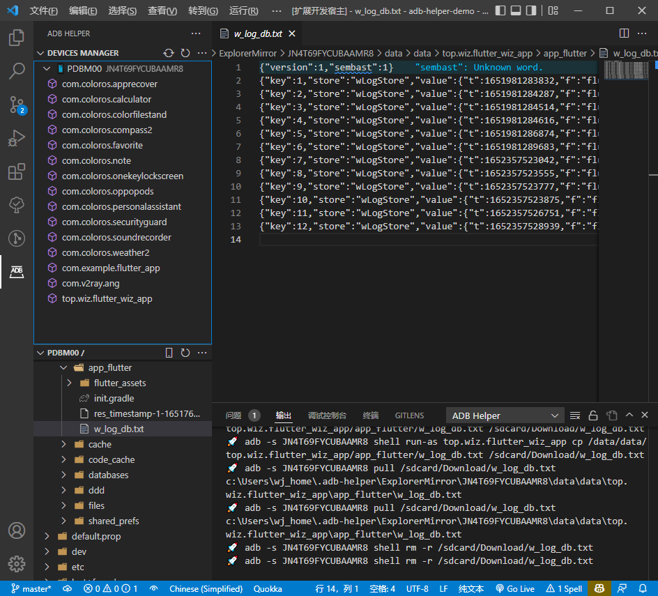

# adb-helper

[](https://marketplace.visualstudio.com/items?itemName=jawa0919.adb-helper) [](https://marketplace.visualstudio.com/items?itemName=jawa0919.adb-helper) [](https://marketplace.visualstudio.com/items?itemName=jawa0919.adb-helper) [](https://github.com/jawa0919/adb-helper/issues)

## introduction

[【中文】](./README_zh.md)

Assist in executing common ADB commands. At present, the functions include device management, WiFi connection, screenshot, application management and file management.



## Function

### AdbController

- [x] restartAdb
- [x] refreshDeviceManager：refreshDevice/APK
- [x] ipConnect：input ip Connect devices to the computer through WLAN, which can replace USB connection.
- [x] ipConnectHistory：Displays the history of using WLAN to connect to ADB
- [x] installToDevice：Install the APK file in the workspace to the device
- [x] chooseApkFilter：Select APK display type, optional: third-party application-3, system application-s, enabled-e, disabled-d


### DeviceController

- [x] screenshot
- [x] installApk
- [x] inputText
- [x] showDeviceInfo
- [x] startScrcpy: start Scrcpy [https://github.com/Genymobile/scrcpy](https://github.com/Genymobile/scrcpy)
- [x] rebootDevice:
- [x] powerOffDevice:
- [x] useIpConnect: Connect ADB using WLAN


### ApkController

- [x] wipeApkData:
- [x] uninstallApk:
- [x] exportApk:
- [x] stopApk:
- [x] copeApkId:


### ExplorerController

- [x] refreshExplorerManager
- [x] chooseDevice
- [x] chooseRootPath
- [ ] openInNewWorkspace(TODO)

### FileController

In the file management system, the opened file is the local mirror copy of the file in the device, and the file in the device cannot be edited.

In addition, in / data / data /, the relevant file directory cannot be obtained due to lack of permission. The APK list is used to virtualize the relevant file directory.

- [x] openFile
- [x] openInTheSide
- [x] newFolder
- [x] copyPath
- [x] rename
- [x] delete
- [x] uploadFile
- [x] uploadFolder
- [x] saveAs


### daemon

When the fluttersdk is not found, the daemon will not be started and the device list needs to be updated manually.

- [x] flutter daemon: Monitor device connection / disconnection

## configure

- [x] explorerRootPathList

  Select the first resource in the default quick access list

  ```json
  [
      "/sdcard/",
      "/",
      "/data/data/",
      "/sdcard/Android/data/",
      "/sdcard/DCIM/",
      "/sdcard/Download/",
  ],
  ```

- [x] adbBinPath
- [x] androidSdkPath
- [x] flutterSdkPath
- [x] scrcpyBinPath：

  If you have configured relevant environment variables, you can ignore them directly

## about

[https://github.com/Genymobile/scrcpy](https://github.com/Genymobile/scrcpy)

[https://github.com/EaniaHuui/android_tool](https://github.com/EaniaHuui/android_tool)

## last

You are welcome to put forward your ideas and feedback [issues](https://github.com/jawa0919/adb-helper/issues)
