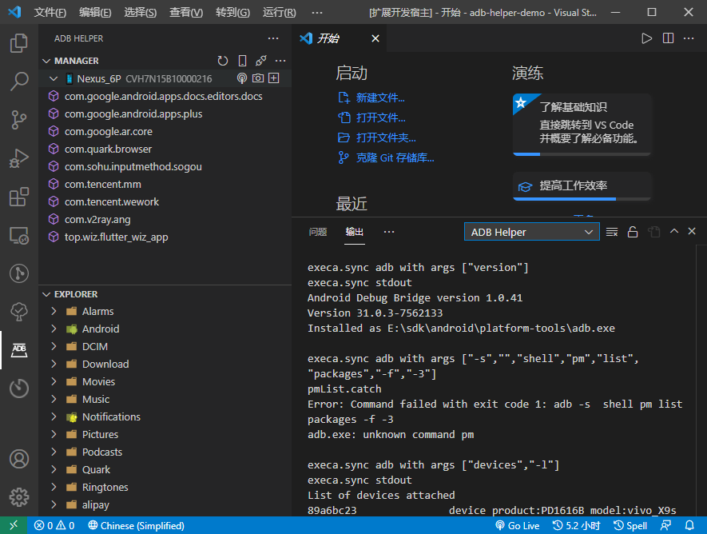
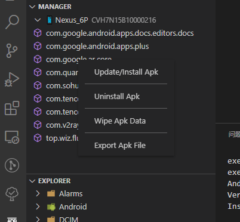
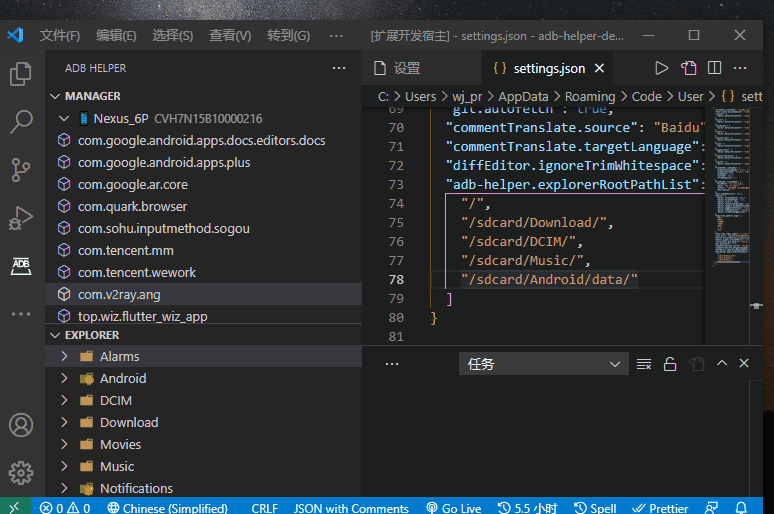
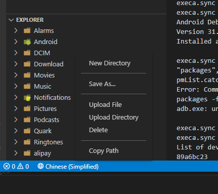
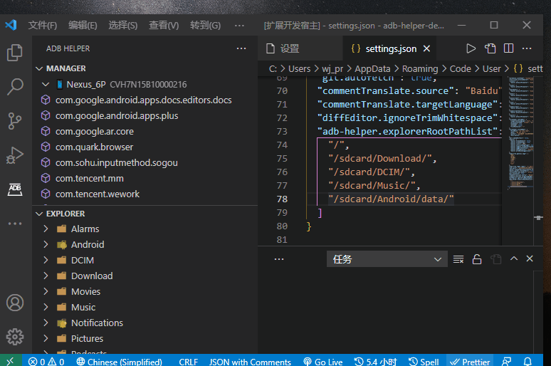

# adb-helper

[](https://marketplace.visualstudio.com/items?itemName=jawa0919.adb-helper) [](https://marketplace.visualstudio.com/items?itemName=jawa0919.adb-helper) [](https://marketplace.visualstudio.com/items?itemName=jawa0919.adb-helper) [](https://github.com/jawa0919/adb-helper/issues)

## 简介

[【English】](./README.md)

辅助执行 adb 常用命令。目前功能有 设备管理，Wifi 连接，截图，应用管理，文件管理。



## 更新

- 应用管理器，用于管理设备上第三方应用的管理。

- 文件管理器，用于管理设备上各种文件，与 Android Studio 文件管理类似。

## 功能

1. 应用管理，升级/安装 app，卸载 app，清除 app 缓存，导出 app 文件。

   

2. adbWifi 管理，使 Android 设备通过 wifi 连接电脑端，可代替 usb 连接。

   

3. 文件管理，包含新建文件夹，导出文件/文件夹，导入文件，导入文件夹，删除文件/文件夹，复制文件路径等功能。

   

   可以配置根路径,注意一些权限问题

   ```json
   {
     "adb-helper.explorerRootPathList": ["/", "/sdcard/Download/", "/sdcard/DCIM/", "/sdcard/Music/", "/sdcard/Android/data/"]
   }
   ```

   

4. 截图

5. usb 连接监听 （使用 flutter sdk 实现）

## adb

欢迎大家提出想法和反馈问题 [issues](https://github.com/jawa0919/adb-helper/issues)

```
Android Debug Bridge version 1.0.41
Version 31.0.3-7562133
Installed as E:\sdk\android\platform-tools\adb.exe
```
