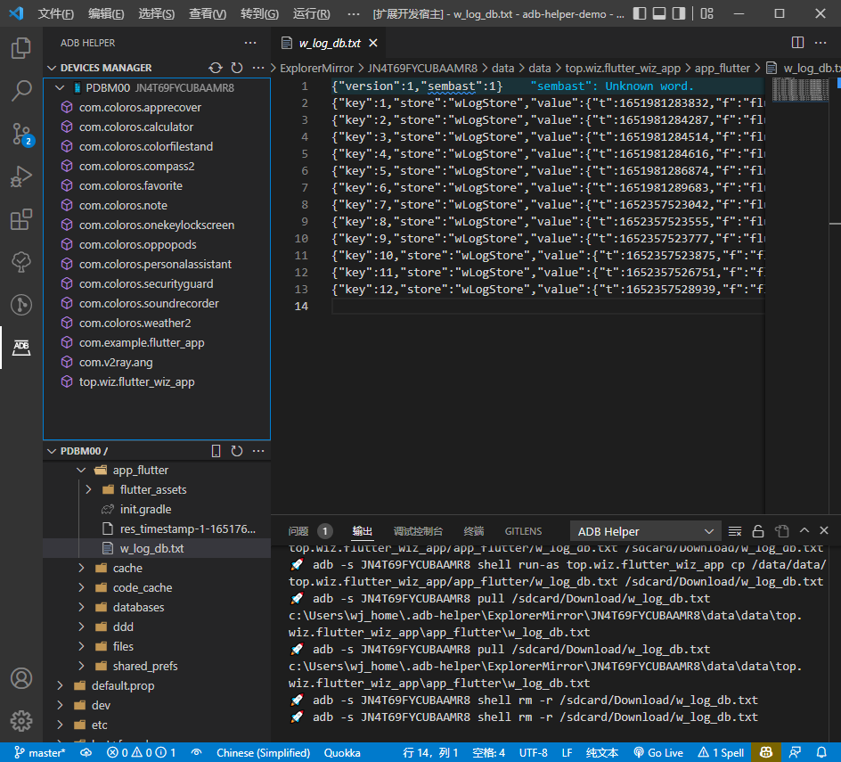
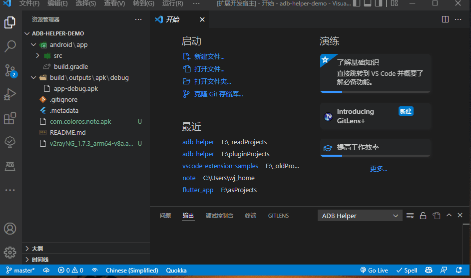
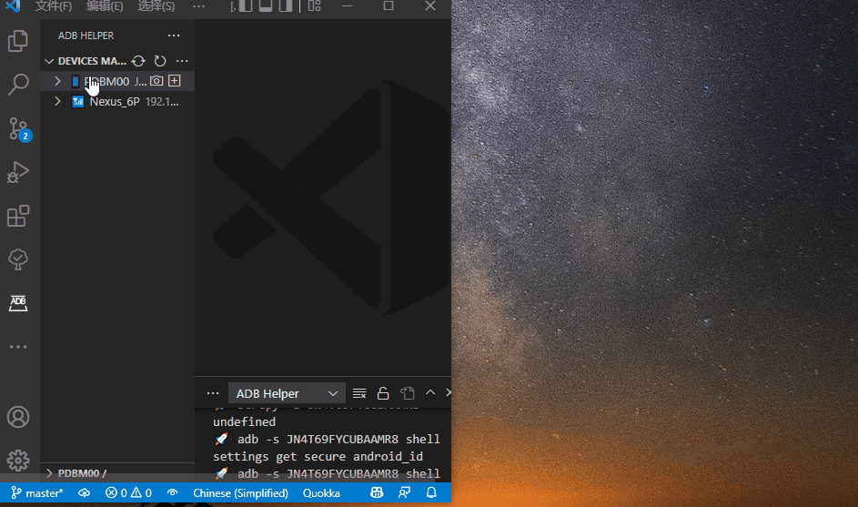
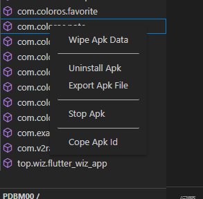
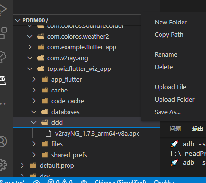

# adb-helper

[](https://marketplace.visualstudio.com/items?itemName=jawa0919.adb-helper) [](https://marketplace.visualstudio.com/items?itemName=jawa0919.adb-helper) [](https://marketplace.visualstudio.com/items?itemName=jawa0919.adb-helper) [](https://github.com/jawa0919/adb-helper/issues)

## 简介

[【English】](./README.md)|[【中文】](./README_zh.md)

帮助执行`ADB`常用命令。设备管理，`ip/pair`连接，设备截图，应用管理，文件管理。



## 功能

### AdbController

- [x] restartAdb：重新启动 ADB 服务
- [x] refreshDeviceManager：刷新设备列表和 apk 列表
- [x] ipConnect：输入设备 ip 连接
- [x] ipConnectHistory：显示使用 ip 连接的历史记录
- [x] pairDevicesScanner: 扫描 pair 配对设备（Android11 以上使用）
- [x] pairDevicesUsingQRCode：使用 pair 的 qrCode 配对设备（Android11 以上使用）
- [x] pairDevicesUsingCode：使用 pair 的 code 配对设备（Android11 以上使用）
- [x] installToDevice：将工作区中的 apk 文件安装到设备
- [x] chooseApkFilter：选择 apk 显示种类，-3：第三方应用（默认），-s：系统应用，-e：启用的应用，-d：停用的应用



### DeviceController

- [x] screenshot: 设备截图
- [x] installApk: 安装 apk
- [x] inputText: 输入文字到设备上
- [x] showDeviceInfo: 显示设备相关信息
- [x] startScrcpy: 启动 Scrcpy [https://github.com/Genymobile/scrcpy](https://github.com/Genymobile/scrcpy)
- [x] rebootDevice: 重启设备
- [x] powerOffDevice: 关闭设备
- [x] useIpConnect: 使用 Ip 连接 ADB
- [x] showLogCat: 显示 logcat 日志



### ApkController

- [x] wipeApkData: 清除 apk 数据
- [x] wipeApkPermissions: 清除 apk 权限
- [x] uninstallApk: 卸载 apk
- [x] exportApk: 导出 apk
- [x] stopApk: 停止 apk
- [x] copyApkId: 复制 apk id
- [x] showLogCatFilter: 显示本 apk 的 logcat 日志



### ExplorerController

- [x] refreshExplorerManager：刷新资源管理器
- [x] chooseDevice：选择资源管理器中的设备
- [x] chooseRootPath：选择资源管理器中的根目录

### FileController

> 文件管理系统中，打开的文件是设备文件在本地镜像的副本文件。

> 在`/data/data/`目录中，因为缺乏权限，无法获得目录。相关文件目录是模拟的。

- [x] openFile：打开文件
- [x] openInTheSide：在右侧打开文件
- [x] openInLocalExplorer：在本地文件管理器中打开
- [x] newFolder：新建文件夹
- [x] copyPath：复制路径
- [x] rename：重命名
- [x] delete：删除
- [x] uploadFile：上传文件
- [x] uploadFolder：上传文件夹
- [x] saveAs：另存到本地



### flutter daemon

> 当没有找到`flutter`时，需要点击`refreshDeviceManager`更新设备列表。

- [x] flutter daemon: 监听设备连接/断开,自动刷新列表

## 配置

- [x] explorerRootPathList：快速访问列表，默认列表中的第一项显示
  ```json
  [
      "/sdcard/",
      "/",
      "/data/data/",
      "/sdcard/Android/data/",
      "/sdcard/DCIM/",
      "/sdcard/Download/",
  ],
  ```
- [x] adbBinPath：`adb`的 Bin 路径,eg: `E:\sdk\androidSDK\platform-tools`
- [x] androidSdkPath：`Android` SDK 的路径,eg: `E:\sdk\androidSDK`
- [x] flutterSdkPath：`Flutter` SDK 的路径,eg: `E:\sdk\flutter339`
- [x] scrcpyBinPath：`Scrcpy` 的 Bin 路径,eg: `C:\Users\admin\AppData\Roaming\Genymobile\scrcpy`

如果已经配置了相关环境变量，可以忽略相关配置

## 相关

[https://github.com/Genymobile/scrcpy](https://github.com/Genymobile/scrcpy)

## 最后

欢迎大家提出想法和反馈问题 [issues](https://github.com/jawa0919/adb-helper/issues)
