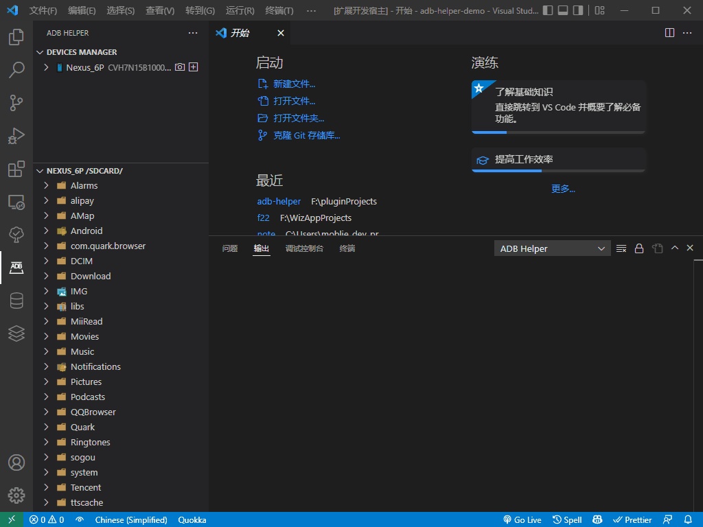

# adb-helper

[](https://marketplace.visualstudio.com/items?itemName=jawa0919.adb-helper) [](https://marketplace.visualstudio.com/items?itemName=jawa0919.adb-helper) [](https://marketplace.visualstudio.com/items?itemName=jawa0919.adb-helper) [](https://github.com/jawa0919/adb-helper/issues)

## 简介

[【English】](./README.md)

辅助执行 adb 常用命令。功能有 设备管理，Wifi 连接，截图，应用管理，文件管理。


## 功能

### AdbController

- restartAdb：用于重新启动 ADB 服务
- refreshDeviceManager：刷新设备列表和 apk 列表
- ipConnect：输入 ip 连接设备,用于使用 WLAN 来连接 ADB 的功能
- ipConnectHistory：显示使用 WLAN 来连接 ADB 的历史记录
- installToDevice：将工作区中的 apk 文件安装到设备
- chooseApkFilter：选择 apk 显示种类，可选：第三方应用-3，系统应用-s，启用的-e，停用的-d



### DeviceController

- screenshot: 设备截图
- installApk: 安装 apk
- inputText: 输入文字
- showDeviceInfo: 显示设备信息
- startScrcpy: 启动 Scrcpy [https://github.com/Genymobile/scrcpy](https://github.com/Genymobile/scrcpy)
- rebootDevice: 重启设备
- powerOffDevice: 关闭设备
- useIpConnect: 使用 WLAN 连接 ADB


### ApkController

- wipeApkData: 清除 apk 数据
- uninstallApk: 卸载 apk
- exportApk: 导出 apk
- stopApk: 停止 apk
- copeApkId: 复制 apk id


### ExplorerController

- refreshExplorerManager：刷新资源管理器
- chooseDevice：选择资源管理器中的设备
- chooseRootPath：选择资源管理器中的根目录

### FileController

文件管理系统，打开的文件是设备中文件的本地镜像副本，并不能编辑设备中文件。

另外在/data/data/中，因为缺乏权限，无法获得相关文件目录，使用 apk 列表虚拟了相关文件目录。

- openFile：打开文件
- openInTheSide：在右侧打开文件
- newFolder：新建文件夹
- copyPath：复制路径
- rename：重命名
- delete：删除
- uploadFile：上传文件
- uploadFolder：上传文件夹
- saveAs：另存为


### daemon

当没有找到 flutterSDK 时，将不会启动此守护程序，需要手动更新设备列表。

- flutter daemon: 监听设备连接/断开

### 功能配置

- explorerRootPathList：资源管理器中的根目录快速访问列表，默认选择列表中的第一个显示
  ```json
  [
      "/sdcard/",
      "/",
      "/data/data/",
      "/sdcard/Android/data/",
      "/sdcard/DCIM/",
      "/sdcard/Download/",
  ],
  ```
- adbBinPath：adb 的 Bin 路径，如果你已经配置了相关环境变量，可以直接忽略
- androidSdkPath：Android SDK 的路径，如果你已经配置了相关环境变量，可以直接忽略
- flutterSdkPath：Flutter SDK 的路径，如果你已经配置了相关环境变量，可以直接忽略
- scrcpyBinPath：Scrcpy 的 Bin 路径，如果你已经配置了相关环境变量，可以直接忽略

## 相关资源

[https://github.com/Genymobile/scrcpy](https://github.com/Genymobile/scrcpy)

[https://github.com/EaniaHuui/android_tool](https://github.com/EaniaHuui/android_tool)

## 最后

欢迎大家提出想法和反馈问题 [issues](https://github.com/jawa0919/adb-helper/issues)
