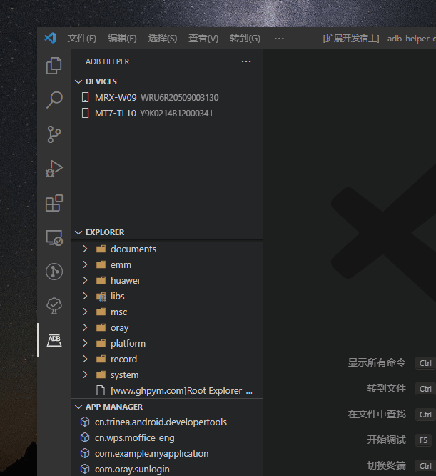
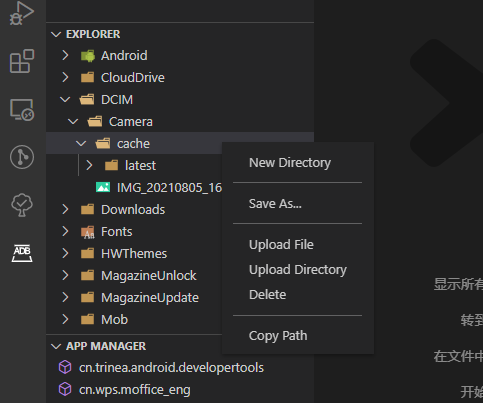
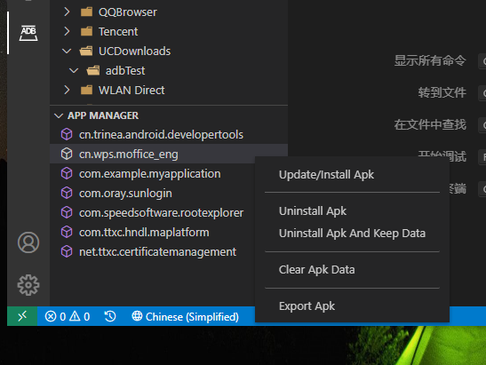

# adb-helper

[【中文】](./../README.md)

ADB helper to assist in executing common ADB commands. At present, the functions include device manager, file manager and application manager.


## V0.0.1 update

-Device manager, which is used to manage ADB connected devices.

-File manager, used to manage various files on the device. Similar to Android studio file management.

-Application manager, which is used to manage third-party applications on the device.

## Function

1. Connect the mobile device to the computer through WiFi instead of USD connection.

   

2. Sdcard / root file management, including creating new folders, exporting files / folders, importing files, importing folders, deleting files / folders, and copying file paths.

   

3. Application manager, upgrade APK, uninstall APK, clear APK cache and export APK.

   

## adb

```
Android Debug Bridge version 1.0.41
Version 31.0.3-7562133
Installed as E:\sdk\android\platform-tools\adb.exe
```
